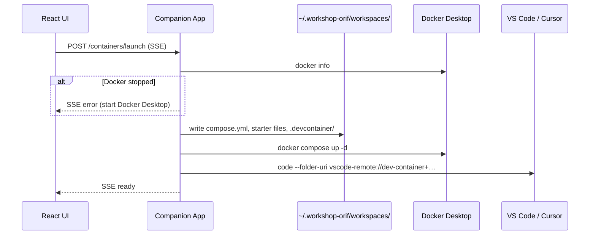

# Companion App Architecture

The **Companion App** is a native tray application (Electron) installed on each learner machine. It bridges the Workshop ORIF web app (running in the browser) to Docker Desktop on the host. Exercise workshops with an **Exercise Runtime** depend on it for Launch and Reset.

See [ADR 0008](../../adr/0008-compose-only-exercise-runtime.md) for the compose-only authoring model and [CONTEXT.md](../../../CONTEXT.md) for domain vocabulary.

---

## Role in the Stack

```
┌─────────────────────┐     HTTP (localhost)      ┌──────────────────────┐
│  Browser (React)    │ ─────────────────────────▶ │  Companion App       │
│  "Lancer l'exercice"│   /companion/* → :37428   │  (Electron tray)     │
└─────────┬───────────┘                           └──────────┬───────────┘
          │                                                    │
          │ /api/* → backend                                     │ docker compose
          ▼                                                    ▼
┌─────────────────────┐                           ┌──────────────────────┐
│  Workshop API       │                           │  Docker Desktop      │
│  (ASP.NET + Mongo)  │                           │  exercise stack      │
└─────────────────────┘                           └──────────┬───────────┘
                                                             │
                                                             │ Dev Containers
                                                             ▼
                                                ┌──────────────────────┐
                                                │  VS Code / Cursor    │
                                                │  (Coding Surface)    │
                                                └──────────────────────┘
```

The web app **never** talks to Docker directly. The Companion App is the only process that runs `docker compose` on the learner machine.

| Component | Runs where | Talks to |
|-----------|------------|----------|
| React frontend | Browser (or Nginx container) | Backend API + Companion (via proxy) |
| Backend API | Docker (`api` container) | MongoDB |
| Companion App | Learner host OS | Docker Desktop + local IDE |
| Exercise stack | Docker Desktop | Bind-mounts learner workspace |

---

## Technology Stack

| Component | Technology |
|-----------|------------|
| Runtime | Node.js ≥ 20 |
| Desktop shell | Electron (tray app) |
| HTTP server | Express on `127.0.0.1:37428` |
| Compose lifecycle | `docker compose up/down` |
| IDE attach | VS Code / Cursor CLI with `--folder-uri` (Dev Containers) |
| Tests | Node.js built-in test runner + `tsx` |

**Source:** [`companion-app/`](../../../companion-app/)

---

## Project Structure

```
companion-app/
├── src/
│   ├── server.ts       # Express app, launch/reset/status handlers
│   ├── workspace.ts    # compose.yml + devcontainer.json materialisation
│   ├── docker.ts       # Docker check, compose up/down
│   ├── settings.ts     # Editor preference (vscode | cursor)
│   ├── userid.ts       # Persistent anonymous learner ID
│   ├── errors.ts       # User-facing error messages
│   └── types.ts        # ExerciseRuntime, LaunchRequestBody
├── test/               # Unit/integration tests (injectable deps)
├── electron/           # Tray wrapper (not covered here)
└── README.md           # Build/run quick reference
```

---

## Exercise Runtime (input contract)

Workshops store an **Exercise Runtime** embedded on the workshop document (`exerciseRuntime`). The frontend passes this payload to the Companion unchanged on Launch.

| Field | Type | Description |
|-------|------|-------------|
| `compose` | string | Docker Compose YAML (single document) |
| `devService` | string | Compose service the IDE attaches to (e.g. `workshop`) |
| `workspaceFiles` | array | Starter files (inline `content` or future `gitUrl`) |

The backend validates compose on author save/import ([`ExerciseRuntimeValidator`](../../../backend/WorkshopOrif.Api/Services/ExerciseRuntimeValidator.cs)). The Companion **does not re-validate** at launch — it trusts the API payload (trusted-author model, ADR 0008).

**Minimal compose example** (Python exercise):

```yaml
services:
  workshop:
    image: python:3.11-slim
    volumes:
      - .:/workspace
    working_dir: /workspace
    command: sh -c "pip install -q openai && sleep infinity"
```

Authors must bind-mount the workspace with a **relative** host path (`.`). Absolute paths, `docker.sock`, privileged mode, and host networking are rejected at import time.

---

## Launch Flow

Triggered when the learner clicks **Lancer l'exercice** in the web UI.



### SSE phases

| Phase | Meaning |
|-------|---------|
| `starting` | Workspace directory and files are being written |
| `pulling` | `docker compose up -d` is running (pull/build output streamed as `message`) |
| `ready` | Stack is up and IDE opened into the dev service |
| `error` | Launch failed; `message` contains French user text |

A Launch is **not successful** until both the compose stack is running **and** the Coding Surface is connected to the dev service.

### Generated files

For each workshop, the Companion writes:

```
~/.workshop-orif/workspaces/<workshopId>/
├── compose.yml                    ← from exerciseRuntime.compose
├── .devcontainer/
│   └── devcontainer.json          ← generated (authors never maintain this)
├── main.py                        ← starter files (first launch only)
└── …
```

Generated `devcontainer.json`:

```json
{
  "name": "Workshop ORIF — <workshopId>",
  "dockerComposeFile": "../compose.yml",
  "service": "<devService>",
  "workspaceFolder": "/workspace"
}
```

The learner's anonymous ID is stored at `~/.workshop-orif/id` (used for future stack identification).

### Full-auto IDE attach

The Companion opens the IDE with a Dev Container folder URI — the learner does **not** click "Reopen in Container":

```
code --folder-uri vscode-remote://dev-container+<base64url(devcontainer.json path)>/workspace
```

Editor preference (`vscode` or `cursor`) is read from `~/.workshop-orif/settings.json`, with fallback to the other CLI if the primary is missing from `PATH`.

---

## Reset Flow

Triggered when the learner confirms **Recommencer l'exercice**:

1. Close VS Code / Cursor if its command line references the workshop workspace
2. `docker compose down --remove-orphans` in the workspace directory
3. Delete `~/.workshop-orif/workspaces/<workshopId>/`
4. On next Launch, starter files are recreated from `workspaceFiles`

---

## HTTP API

Base URL: **`http://127.0.0.1:37428`**

The frontend reaches it via proxy:

| Environment | Browser URL | Proxied to |
|-------------|-------------|------------|
| Vite dev | `/companion/*` | `http://127.0.0.1:37428/*` |
| Nginx prod | `/companion/*` | `http://host.docker.internal:37428/*` |

### `GET /health`

Liveness probe. Docker is checked during launch, not here.

```json
{ "status": "ok", "userId": "<uuid>", "version": "0.1.0" }
```

### `GET /containers/:workshopId/status`

```json
{ "ready": true }
```

`ready` is `true` when `compose.yml` exists in the workshop workspace (stack may still be stopped after a host reboot — relaunch runs `compose up` again).

### `POST /containers/launch`

**Request body:**

```json
{
  "workshopId": "507f1f77bcf86cd799439011",
  "compose": "services:\n  workshop:\n    image: python:3.11-slim\n    volumes:\n      - .:/workspace\n    working_dir: /workspace\n    command: sleep infinity\n",
  "devService": "workshop",
  "workspaceFiles": [
    { "name": "main.py", "content": "# starter\n" }
  ]
}
```

**Response:** `text/event-stream` (SSE), one JSON object per event: `{ "phase": "…", "message": "…" }`.

**Errors:** `400` if `workshopId`, `compose`, or `devService` is missing.

### `POST /containers/reset`

**Request body:** `{ "workshopId": "…" }`

**Response:** `{ "ok": true, "editorClosed": true }` or `{ "error": "…" }` with 4xx/5xx.

---

## Browser Integration

[`DockerLaunchButton.tsx`](../../../frontend/src/components/DockerLaunchButton.tsx):

1. `GET /companion/health` — verify Companion is running
2. `POST /companion/containers/launch` — SSE stream until `ready` or `error`
3. `POST /companion/containers/reset` — on restart confirmation

Workshop detail loads `exerciseRuntime` from `GET /api/workshops/{id}` and passes it to the launch button.

---

## Testing

Companion tests use **injectable dependencies** (mock `fs`, `execFile`, handler deps) — no real Docker required.

```bash
cd companion-app
npm test
```

Coverage includes:

- `buildDevcontainerJson` — compose file + dev service
- `prepareWorkspace` — writes `compose.yml`, preserves learner edits
- Launch handler — SSE phases, error paths, client disconnect
- Reset handler — editor close ordering, user-facing lock errors

Frontend e2e (Playwright) mocks the Companion API: [`frontend/e2e/workshop-detail-docker.spec.ts`](../../../frontend/e2e/workshop-detail-docker.spec.ts).

See [Testing Guide](../testing.md) for the full test matrix.

---

## Build and Run

```bash
cd companion-app
npm ci
npm run build
npm start          # Electron tray app
```

The Companion is **not** part of the root `docker compose up` stack. Each learner installs and runs it on their machine alongside Docker Desktop.

---

## Related Documentation

- [Backend Architecture](../backend/backend-architecture.md) — Exercise Runtime model and compose validation
- [Frontend Architecture](../frontend/frontend-architecture.md) — Launch UI
- [JSON Reference](../../how-to/json-reference.md) — Authoring `exerciseRuntime` in workshop JSON
- [ADR 0008 — Compose-Only Exercise Runtime](../../adr/0008-compose-only-exercise-runtime.md)
- [ADR 0007 — Docker Environments for Exercises](../../adr/0007-docker-environments-for-exercises.md) (superseded authoring shape)
